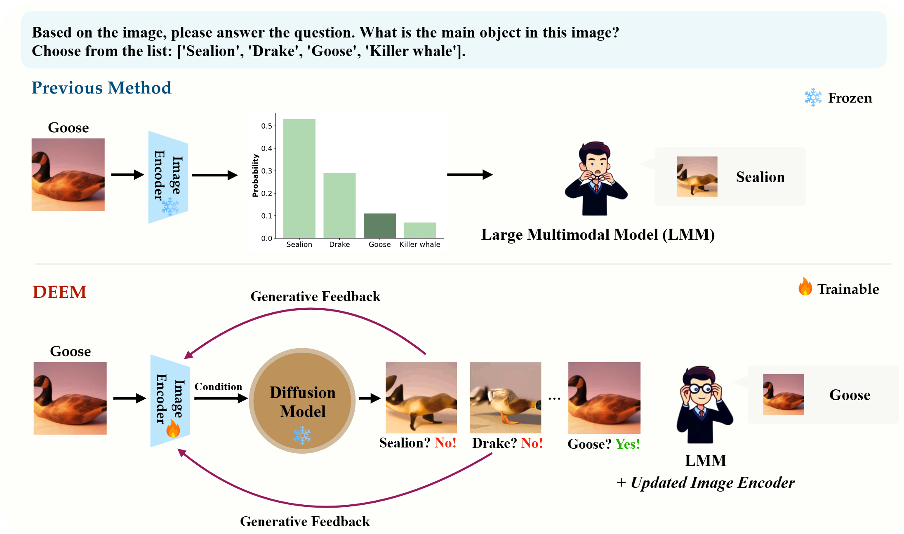
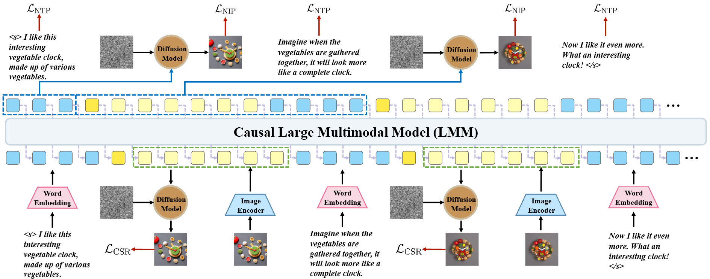
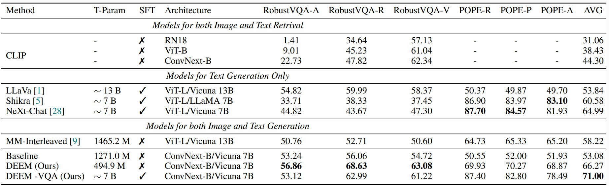
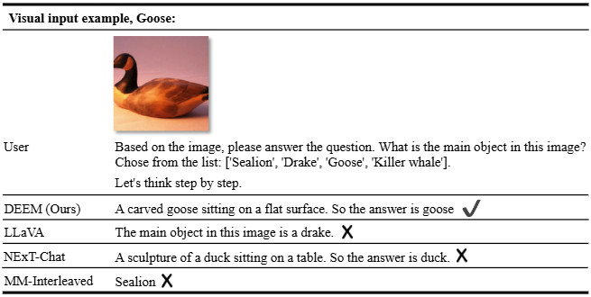
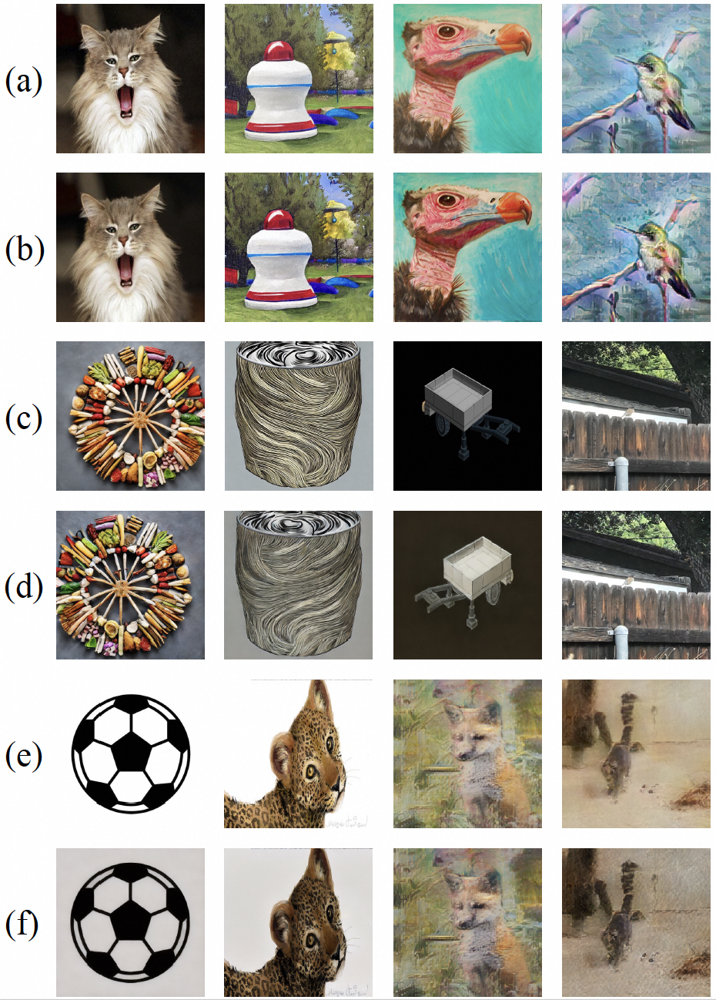
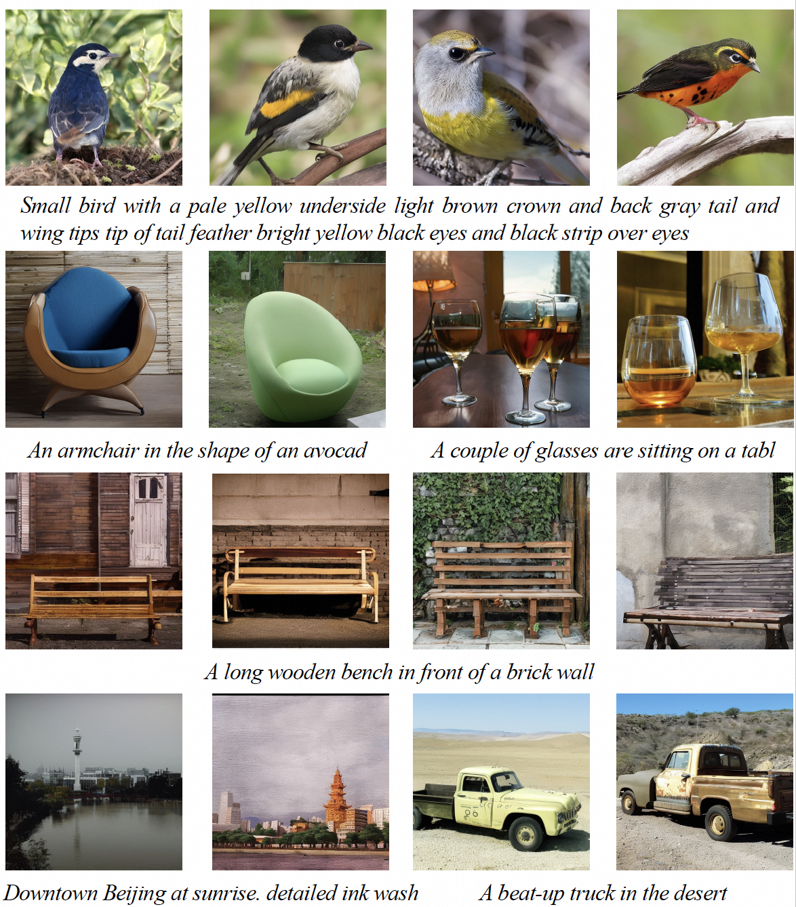
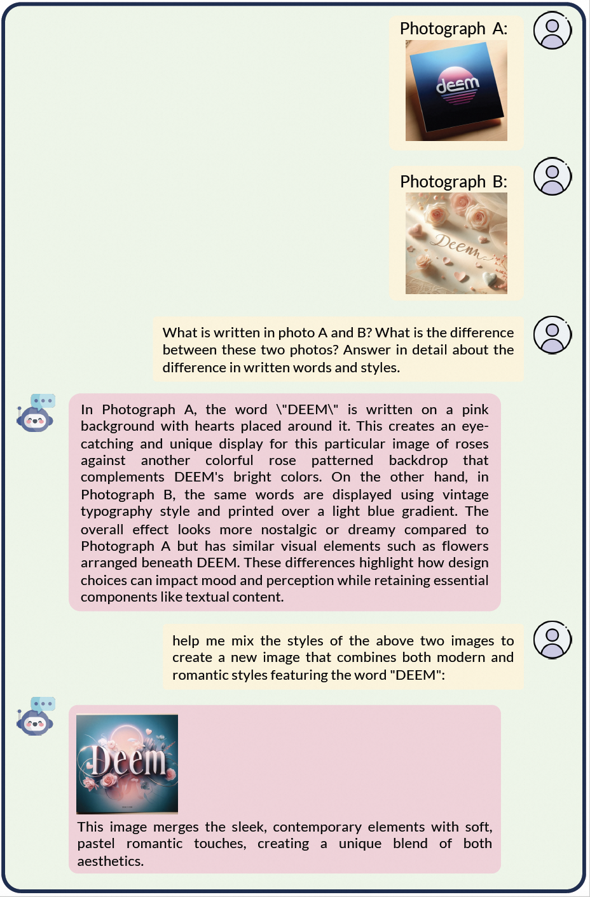
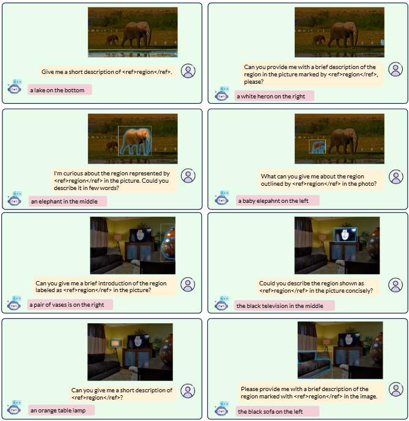

<!-- # DEEM -->

# DEEM: Diffusion models serve as the eyes of large language models for image perception

<div align="center">
<br>
<a href="https://scholar.google.com/citations?user=phg8yxoAAAAJ&hl=zh-CN&oi=ao">Run Luo</a><sup><span>1,2*</span></sup>, 
<a href="https://scholar.google.com/citations?user=juR8ZS4AAAAJ&hl=zh-CN">Yunshui Li</a><sup><span>1,2*</span></sup>,
<a href="https://github.com/October2001">Longze Chen</a><sup><span>1,2*</span></sup>,
<a>Wanwei He</a><sup><span>1,2</span></sup>,
<a>Ting-En Lin</a><sup><span>5</span></sup>,
<a>Ziqiang Liu<sup><span>1,2</span></sup>,
<a>Lei Zhang<sup><span>1,2</span></sup>
<br>
<a>Zikai Song<sup><span>6</span></sup>,
<a>Xiaobo Xia<sup><span>4</span></sup>,
<a>Tongliang Liu<sup><span>4</span></sup>,
<a>Min Yang<sup><span>1,2🌟</span></sup>,
<a>Binyuan Hui<sup><span>3🌟</span></sup>
<br>
    
\* Equal contribution 🌟 Corresponding author

<sup>1</sup> Shenzhen Institute of Advanced Technology, Chinese Academy of Sciences<br>
<sup>2</sup> University of Chinese Academy of Sciences<br>
<sup>3</sup> Alibaba Group
<sup>4</sup> The University of Sydney 
<sup>5</sup> Tsinghua University
<sup>6</sup> HUST<br>
    
 <a href='https://arxiv.org/pdf/2405.15232'></a> <a href='https://huggingface.co/collections/yifanzhang114/slime-665bcb2d0d71762b86fdbd2d'></a> <a href='https://huggingface.co/datasets/yifanzhang114/SMR'></a>

</div>

<p align="center">
    
</p>

<font size=5><div align='center' >  [[📖 arXiv Paper](https://arxiv.org/pdf/2405.15232)] [[📊 Dataset](https://github.com/RainBowLuoCS/DEEM)] [[🏆 Models](https://github.com/RainBowLuoCS/DEEM)]  </div></font>
DEEM is an exploration of using diffusion models as the eyes of multi-modal large language models, with the goal of eliminating potential biases in different visual encoders from a vision-centric perspective. We hope that DEEM can bring some thinking to the multimodal community, whether the unbiased diffusion model can replace the traditional visual encoder and become the second unified multimodal structure besides self-regression.

## 🔥 Update

- [07/21]🔥DEEM is coming! We release the [code](https://github.com/RainBowLuoCS/DEEM), [models](https://github.com/RainBowLuoCS/DEEM), and [data](https://github.com/RainBowLuoCS/DEEM) for DEEM!
- [07/05]🔥DEEM is coming! We release the [paper](https://arxiv.org/abs/2405.15232) for DEEM!

## 👀 Contents

- [Setup](#Setup)
- [Model](#model)
- [Preparation](#preparation)
- [Train](#train)
- [Evaluation](#evaluation)
- [Examples](#examples)
- [Citation](#citation)


## 📷 Setup

Please follow the instructions below to install the required packages.


1. Clone this repository

```bash
https://github.com/RainBowLuoCS/DEEM.git
```

2. Install Package

```bash
conda create -n deem python=3.10 -y
conda activate deem
cd DEEM
pip install -r requirements.txt
# install `MultiScaleDeformableAttention` module
cd uni_interleaved/models/utils/ops
python setup.py install
```

3. Download all pretrained model components from huggingface into the `assets/` directory by running the following commands:

```bash
python scripts/download_models.py
```

## 🔍 Model

Here are the pretrained weights on Stage 1 data only:

| Model                        | Diffusion Model | Base LLM       | Vision Encoder | Pretrain Data | Download |
| ---------------------------- | --------------- | -------------- | -------------- | ------------- | -------- |
| MM-interleaved-7B (Baseline) | SD 2.1 🔥        | Vicuna-7B-v1.5 | ConvNext-B     | MMC4+LAION    | [ckpt]() |
| DEEM-7B                      | SD 2.1          | Vicuna-7B-v1.5 | ConvNext-B🔥    | MMC4+LAION    | [ckpt]() |
| (DEEM+MM-interleaved)-7B     | SD 2.1 🔥        | Vicuna-7B-v1.5 | ConvNext-B🔥    | MMC4+LAION    | [ckpt]() |

We provide all our fully finetuned models on Stage 2 and 3 data for DEEM:

| Model         | Base LLM       | Vision Encoder | Finetuning Data       | Download |
| ------------- | -------------- | -------------- | --------------------- | -------- |
| DEEM-VQA 7B   | Vicuna-7B-v1.5 | ConvNext-B     | LLaVA-665k+VQA+COCO   | [ckpt]() |
| DEEM-MASK 7B  | Vicuna-7B-v1.5 | ConvNext-B     | ReferCOCO+VG+PartData | [ckpt]() |

## 💡 Preparation

### Dataset

Please follow [MM-Interleaved](https://github.com/OpenGVLab/MM-Interleaved) , [LLaVA](https://github.com/haotian-liu/LLaVA) and [Osprey](https://github.com/CircleRadon/Osprey) to prepare the corresponding images and data.

### DEEM data structure

```
datasets
├── laion
│   ├── laion_annts
│   │   └── laion_shard_{0...1774}_v1.json
│   └── laion_images
│   │   └── {00000..01174}.tar
├── mmc4
│   ├── mmc4_annts
│   │   └── docs_no_face_shard_{0..23098}_v3.jsonl
│   └── mmc4_images
│   │   └── b9040a0dbb22.jpg
├── aokvqa
│   └── aokvqa_v1p0_train.json
├── image2parag
│   ├── paragraphs_coco.json
│   ├── paragraphs_v1.json
│   ├── test_split.json
│   ├── train_split.json
│   └── val_split.json
├── coco
│   ├── train2014 
│   ├── train2017
│   ├── val2014
│   ├── val2017
│   └── annotations
│   │   ├── coco_karpathy_train.json    
│   │   ├── coco_karpathy_val.json  
│   │   ├── captions_train2017.json          
│   │   ├── coco_karpathy_val_gt.json         
│   │   ├── coco_karpathy_test.json   
│   │   ├── instances_train2017
│   │   └── coco_karpathy_test_gt.json
├── lncoco
│   ├── coco_train_captions.jsonl
│   └── coco_val_captions.jsonl
├── flickr30k
│   ├── flickr30k-images  
│   ├── captiontobbox.json 
│   ├── flickr30k_test1k.json
│   ├── phrasetobbox.json
│   └── groundedcaption.json
├── gqa
│   ├── images  
│   ├── test_balanced_questions.json
│   ├── train_balanced_questions.json
│   └── testdev_balanced_questions.json 
├── robustvqa
│   ├── imagenet-r 
│   ├── imagenet-a
│   ├── imagenetv2
│   └── robustvqa_test.json
├── llava
│   └── llava_v1_5_mix665k.json
├── nocaps
│   ├── val_imgs
│   └── nocaps_val_4500_captions.json
├── ocr_vqa
│   ├── images 
│   └── dataset.json
├── okvqa
│   ├── OpenEnded_mscoco_train2014_questions.json
│   ├── OpenEnded_mscoco_val2014_questions.json 
│   ├── mscoco_train2014_annotations.json
│   └── mscoco_val2014_annotations.json
├── part_data
│   ├── test.json
│   ├── train.json
│   ├── val.json
│   ├── partImagenet 
│   │   ├── train         
│   │   └── partImagenet_train_format.json
│   └── pascal_part
│   │   ├── VOCdevkit   
│   │   └── pascalpart_train.json
├── pope
│   ├── coco_pope_adversarial.json
│   ├── coco_pope_popular.json
│   └── coco_pope_random.jso
├── refcoco
│   ├── refcoco+
│   ├── refcoco
│   ├── refcocog
│   ├── finetune_refcoco+_train_with_mask.json 
│   ├── finetune_refcoco_train_with_mask.json
│   └── finetune_refcocog_val_with_mask.json
├── textcaps
│   ├── TextCaps_0.1_train.json
│   └── TextCaps_0.1_val.json
├── textvqa
│   ├── train_images
│   ├── TextVQA_0.5.1_train.json
│   ├── textvqa_val_annotations.json
│   ├── TextVQA_0.5.1_val.json
│   └── textvqa_val_questions.json 
├── vcr
│   ├── vcr1images
│   ├── test.jsonl
│   ├── train.jsonl
│   ├── val.jsonl
│   └── textvqa_val_questions.json 
├── vg
│   ├── VG_100K
│   ├── VG_100k_2
│   ├── region_descriptions.json
│   ├── image_data.json
│   ├── vg_train_with_mask.json
│   └── question_answers.json 
├── visdial
│   ├── VisualDialog_val2018
│   ├── visdial_1.0_val_dense_annotations.json
│   └── visdial_1.0_val.json  
├── vizwiz
│   ├── val
│   ├── test.json
│   ├── train.json
│   └── val.json 
└── vqav2
│   ├── v2_OpenEnded_mscoco_train2014_questions.json
│   ├── v2_OpenEnded_mscoco_val2014_questions.json
│   ├── v2_mscoco_train2014_annotations.json
│   └── v2_mscoco_val2014_annotations.json 

```

We provide two very convenient scripts to download a large amount of pre-training data, laion and mmc4. You can download the pre-training data by running the following scripts. Due to network reasons, only 40% of the data can be obtained in the end.

```bash
python ./scripts/download_laion.py --mode=annt
python ./scripts/download_mmc4.py --mode=annt
python ./scripts/download_laion.py --mode=images
python ./scripts/download_mmc4.py --mode=images
```

You can find all dataset downloading and convertaion scripts or information in `scripts/`

Note that after downloading the mmc4 dataset, you need to use the following conversion script to convert it into the pre-trained format. Use the corresponding version according to the download method you choose.

```bash
python ./scripts/convert_mmc4_for_pretrain.py
```

You can use the robustvqa file we provide in datasets or regenerate it yourself using the script

```bash
python ./scripts/convert_imagenet_for_robustvqa_test.py
```


## 📈 Train

<div align='center' >
<details>
<summary> Click to see the detail model structure</summary>
<p align="center">

</details>
</div>

DEEM training consists of three stages: (1) image-text alignment  pre-training; (2) image-text supervised fine-tuning ; and (3) mask-text supervised fine-tuning.

DEEM is trained on 32 A100 GPUs with 80GB memory. To train on fewer GPUs, you can reduce the `per_device_train_batch_size` and increase the `gradient_accumulation_steps` accordingly. Always keep the global batch size the same: `per_device_train_batch_size` x `gradient_accumulation_steps` x `num_gpus`.

Please make sure you download and organize the data following [Preparation](#preparation) before training and evaluation.

```bash
bash scripts/train.sh
```


## 📈 Evaluation

We perform evaluation on several image-based benchmarks. Please see our paper for the more details.

<div align=center>

</div>

If you want to evaluate the model on image-based benchmarks, please use the evaluation scripts  for automatic evaluation.

```bash
bash scripts/evaluate.sh
```

For gqa we need to use the following script separately for evaluation.

```bash
unzip -d ./uni_interleaved/utils/gqa_metrics_src/ ./uni_interleaved/utils/gqa_metrics_src/train_choices.zip
python ./uni_interleaved/utils/gqa_eval.py
```

## 👀 Examples

We provide some examples in this section. More examples can be found in our paper

<div align=center>

</div>

<div align='center' >
<details>
<summary> Click to expand more examples</summary>
<p align="center">
    
    
    
    
</details>
</div>

## Schedule

- [x] Release training & evaluation code

- [x] Release stage 1 image-text alignment  pre-training  model weights

- [ ] Release stage 2 image-text sft  model weights

- [ ] Release stage 3 mask-text sft  model weights

## Citation

If you find this repo useful for your research, please consider citing the paper

```
@article{luo2024deem,
  title={Deem: Diffusion models serve as the eyes of large language models for image perception},
  author={Luo, Run and Li, Yunshui and Chen, Longze and He, Wanwei and Lin, Ting-En and Liu, Ziqiang and Zhang, Lei and Song, Zikai and Xia, Xiaobo and Liu, Tongliang and others},
  journal={arXiv preprint arXiv:2405.15232},
  year={2024}
}
```

## Acknowledgement

We would like to thank the following repos for their great work:

- This work is built upon the[MM-Interleaved](https://github.com/OpenGVLab/MM-Interleaved)
- This work utilizes LLMs from , [Vicuna](https://github.com/lm-sys/FastChat)
- This work utilizes the great work from [OpenFlamingo](https://github.com/mlfoundations/open_flamingo), [transformers](https://github.com/huggingface/transformers), [diffusers](https://github.com/huggingface/diffusers), [LLaMA](https://github.com/facebookresearch/llama), [CLIP](https://github.com/openai/CLIP), [BLIP](https://github.com/salesforce/BLIP), [ViT-Adapter](https://github.com/czczup/ViT-Adapter) and [Osprey](https://github.com/CircleRadon/Osprey).

## License

This project is released under the [Apache 2.0 license](https://github.com/RainBowLuoCS/DEEM/blob/main/LICENSE). Parts of this project contain code and models from other sources, which are subject to their respective licenses.

